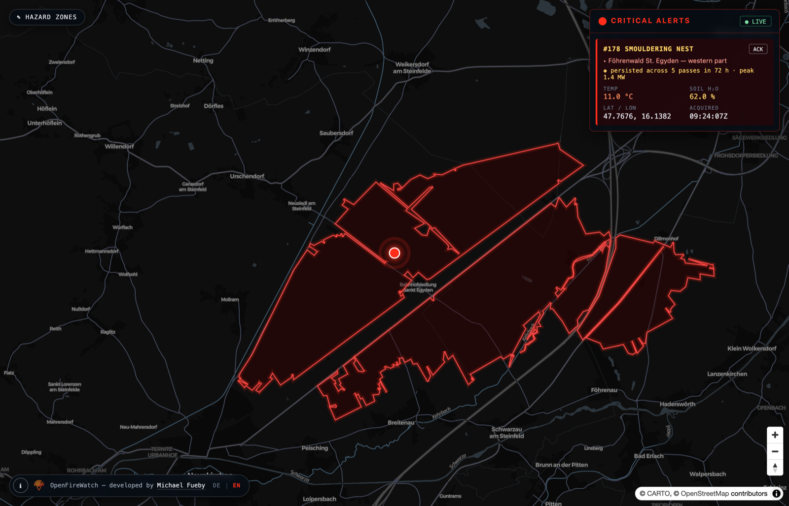

<p align="center">
  
</p>

<h1 align="center">OpenFireWatch</h1>

<p align="center">
  <strong>Open-source geospatial early warning for thermal anomalies — from satellite pass to map alert in seconds.</strong>
</p>

OpenFireWatch is an event-driven early warning system that detects and alerts on thermal anomalies — wildfires, industrial fires, or self-igniting phosphorus ammunition — in near real-time. It continuously ingests satellite hotspot data (NASA FIRMS) and local weather conditions, evaluates every detection against predefined high-risk geographical zones using true spatial queries (PostGIS `ST_Intersects`), and pushes alerts to a live map over WebSockets — no page reloads, no polling.

Built on a **pure TypeScript stack**: Node.js + BullMQ workers, a NestJS API, and an Angular + MapLibre GL JS frontend.

<p align="center">
  
</p>

<p align="center">
  <em>A smouldering nest detected inside a monitored forest — the alert carries the
  evidence behind it: five satellite passes over 72 h, peaking at 1.4 MW.</em>
</p>

<p align="center">
  <a href="LICENSE"></a>
  <a href="#-architecture"></a>
  <a href="#-quick-start"></a>
  <a href="#-architecture"></a>
  <a href="#-contributing"></a>
</p>

---

## 🗺️ Architecture

OpenFireWatch is **fault-tolerant and event-driven by design**. Every layer is decoupled through Redis, so a slow upstream API, a burst of detections, or a restarting service never takes down the pipeline.

> 📐 **[Full architecture documentation →](docs/architecture.md)** — C4 context and
> container diagrams, the end-to-end sequence, the phosphorus decision rule, the
> retry/dead-letter model, the data model, and the rationale behind each design
> decision.
>
> 🗺️ **[Monitoring areas & risk zones →](docs/monitoring-areas.md)** — how to
> enlarge or move the observed area, add further hazard zones, and verify the
> change before trusting it.

```
 ┌──────────────┐   ┌──────────────┐
 │  NASA FIRMS  │   │ Weather APIs │            External sources
 └──────┬───────┘   └──────┬───────┘
        │  poll w/ exponential backoff
        ▼                  ▼
 ┌─────────────────────────────────┐
 │   INGESTION WORKERS (Node.js)   │  Isolated BullMQ background workers.
 │  retry → backoff → dead letter  │  A crash here never affects the
 └───────────────┬─────────────────┘  API or the frontend.
                 │ enqueue raw detection events
                 ▼
 ┌─────────────────────────────────┐
 │        REDIS (event bus)        │  BullMQ queues for durable work,
 │   BullMQ queues + pub/sub + DLQ │  pub/sub for alert fan-out.
 └───────┬─────────────────┬───────┘
         │ persist         │ "alerts:anomalies" channel
         ▼                 ▼
 ┌───────────────┐  ┌─────────────────────┐
 │  PostgreSQL   │  │   NESTJS API        │  Stateless. class-validator
 │   + PostGIS   │◄─┤ REST + Socket.IO WS │  DTOs, auto-generated
 │ ST_Intersects │  └──────────┬──────────┘  OpenAPI/Swagger docs.
 │ dedup + GiST  │             │ emit "anomaly:new"
 └───────────────┘             ▼
                    ┌─────────────────────┐
                    │  ANGULAR FRONTEND   │  MapLibre GL JS live map,
                    │ MapLibre + Socket.IO│  updates in place.
                    └─────────────────────┘
```

**The event flow, step by step:**

1. **Ingest** — BullMQ workers poll NASA FIRMS and weather APIs on a schedule. Failures retry with exponential backoff; jobs that exhaust their retries land in a dead letter queue for inspection instead of blocking the pipeline.
2. **Enqueue** — Each raw detection becomes a job on a durable Redis-backed BullMQ queue. Producers and consumers never talk to each other directly.
3. **Persist & filter** — Detections are deduplicated (same source, same pixel, same acquisition time = one row) and stored in PostgreSQL/PostGIS — the single source of truth. Spatial filtering against high-risk zones happens **in the database** with `ST_Intersects` on GiST-indexed geometries, not in application code.
4. **Alert** — Detections intersecting a risk zone are published on a Redis pub/sub channel. The stateless NestJS layer relays them to all connected clients as Socket.IO events.
5. **Render** — The Angular frontend receives the event and drops the anomaly onto a MapLibre GL map instantly.

## ✨ Features

- 🛰️ **Multi-source ingestion** — NASA FIRMS (VIIRS/MODIS) hotspots and local weather data, extensible to any provider.
- 🧭 **True spatial filtering** — `ST_Intersects` against GiST-indexed risk-zone polygons in PostGIS; no bounding-box approximations.
- ⚡ **Real-time WebSockets** — Socket.IO push to the map the moment an anomaly is confirmed; zero page reloads.
- 🛡️ **API fault tolerance** — exponential backoff, bounded retries, and dead letter queues on every external call, powered by BullMQ.
- 🧩 **Event-driven decoupling** — Redis as the event bus; every component can restart independently without data loss.
- 🗃️ **Idempotent deduplication** — database-level unique constraints make re-ingesting the same satellite pass a no-op.
- 📜 **Strict validation & OpenAPI** — `class-validator` DTOs guard every endpoint; interactive Swagger docs at `/api/docs`.
- 🌍 **Bilingual UI (EN/DE)** — the interface follows the browser language and can be switched live; risk-zone labels are stored per language (`name_en` / `name_de`) and travel inside the alert payload, because one broadcast reaches clients with different languages.
- 🐳 **One-command dev environment** — the entire stack (DB, broker, API, workers, frontend) via a single `docker compose up`.

## 🚀 Quick Start

**Prerequisites:** Docker and Docker Compose (v2+). Nothing else — no local Node.js or PostgreSQL required.

```bash
# 1. Clone the repository
git clone https://github.com/michifueby/OpenFireWatch.git
cd OpenFireWatch

# 2. Configure your environment (add your NASA FIRMS map key)
cp .env.example .env

# 3. Launch the entire stack
docker compose up --build
```

Then open:

| Service         | URL                                                      |
| --------------- | -------------------------------------------------------- |
| 🗺️ Live map      | [http://localhost:4200](http://localhost:4200)           |
| 📖 Swagger docs  | [http://localhost:8000/api/docs](http://localhost:8000/api/docs) |
| ❤️ Health check  | [http://localhost:8000/api/health](http://localhost:8000/api/health) |

Get a free NASA FIRMS map key at <https://firms.modaps.eosdis.nasa.gov/api/map_key/> and set `FIRMS_MAP_KEY` in your `.env`.

## 🤝 Contributing

Contributions are what make open source thrive — and early warning systems save lives. We welcome them all.

1. **Fork** the repository and create your branch from `main`: `git checkout -b feat/my-feature`.
2. **Follow the conventions** — all code, comments, commit messages, and documentation are strictly in **English**. Commits follow [Conventional Commits](https://www.conventionalcommits.org/) (`feat:`, `fix:`, `docs:` …). TypeScript is `strict: true` everywhere — no `any` escapes.
3. **Test your changes** — `docker compose up` must succeed cleanly, and new logic should ship with tests.
4. **Open a Pull Request** with a clear description of the problem and your solution. Small, focused PRs are reviewed fastest.
5. **Found a bug or have an idea?** Open an issue first for anything larger than a quick fix so we can discuss the approach.

Please be kind and constructive — we follow the [Contributor Covenant](CODE_OF_CONDUCT.md).

Full details are in [CONTRIBUTING.md](CONTRIBUTING.md); for security issues see [SECURITY.md](SECURITY.md) — please do not open a public issue for those.

## 👤 Developer

Developed and maintained by **Michael Fueby** ([@michifueby](https://github.com/michifueby)).

### Brand assets

The logo is vector art, kept in the frontend's public folder so the app, the
browser tab and this README all use the same source of truth:

| File | Used for |
| ---- | -------- |
| [`frontend/public/logo.svg`](frontend/public/logo.svg) | Full mark — README, in-app UI, social preview |
| [`frontend/public/favicon.svg`](frontend/public/favicon.svg) | Simplified mark for the browser tab (legible at 16 px) |

Logo and name are part of the project's identity — please don't use them to
imply endorsement of a fork. The source code remains MIT-licensed.

## 🇩🇪 Kurzbeschreibung (Deutsch)

> Die Projektsprache ist Englisch — dieser Abschnitt fasst das System für alle verständlich auf Deutsch zusammen.

**OpenFireWatch** ist ein Open-Source-Frühwarnsystem, das gefährliche Hitzequellen — zum Beispiel Waldbrände oder sich selbst entzündende Phosphormunition (etwa im Föhrenwald bei Wiener Neustadt) — nahezu in Echtzeit erkennt und auf einer Live-Karte meldet.

**So funktioniert es, Schritt für Schritt:**

1. **Satellitendaten holen:** Das System fragt regelmäßig die NASA-Satellitendaten (FIRMS) ab. Diese zeigen, wo auf der Erde gerade ungewöhnliche Hitze gemessen wird.
2. **Wetter dazunehmen:** Gleichzeitig werden aktuelle Wetterdaten von GeoSphere Austria geladen — vor allem Lufttemperatur und Luftfeuchtigkeit — sowie die Bodenfeuchte.
3. **Gefahr bewerten:** Jeder Hitzepunkt wird mit hinterlegten Risikozonen (z. B. dem Föhrenwald) verglichen. Liegt er in einer Zone **und** ist es heißer als 30 °C **und** ist der Boden sehr trocken (unter 20 % Bodenfeuchte — dann reißt der Boden auf und vergrabene Phosphormunition kommt mit Sauerstoff in Kontakt), wird der höchste Alarm **„KRITISCHER PHOSPHORBRAND"** ausgelöst.
4. **Sofort alarmieren:** Der Alarm erscheint ohne Verzögerung auf einer dunklen Einsatzkarte im Browser — als pulsierender roter Punkt mit allen wichtigen Daten (Temperatur, Bodenfeuchte, exakte Koordinaten) für die Einsatzkräfte.

Das gesamte System startet mit einem einzigen Befehl (`docker compose up`) und ist so gebaut, dass es auch bei Ausfällen einzelner Datenquellen stabil weiterläuft.

## 📄 License

Distributed under the MIT License. See [LICENSE](LICENSE) for details.

---

*OpenFireWatch is an independent open-source project and is not affiliated with NASA. FIRMS data courtesy of NASA's Fire Information for Resource Management System. Weather data by [GeoSphere Austria](https://data.hub.geosphere.at/) and [Open-Meteo](https://open-meteo.com/). Base map © [CARTO](https://carto.com/), map data and the seeded Föhrenwald outline © [OpenStreetMap](https://www.openstreetmap.org/copyright) contributors (ODbL).*

*The bundled Föhrenwald zone is a **demonstration boundary derived from land cover**, not an official hazard or contamination map. Any real deployment must replace it with the boundary published by the responsible authority.*
