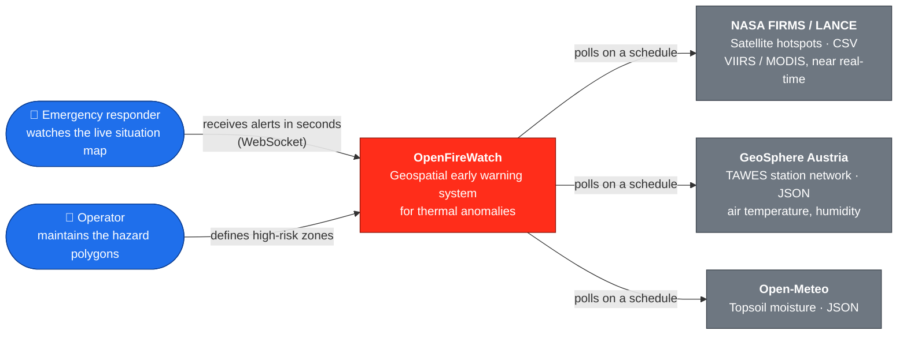
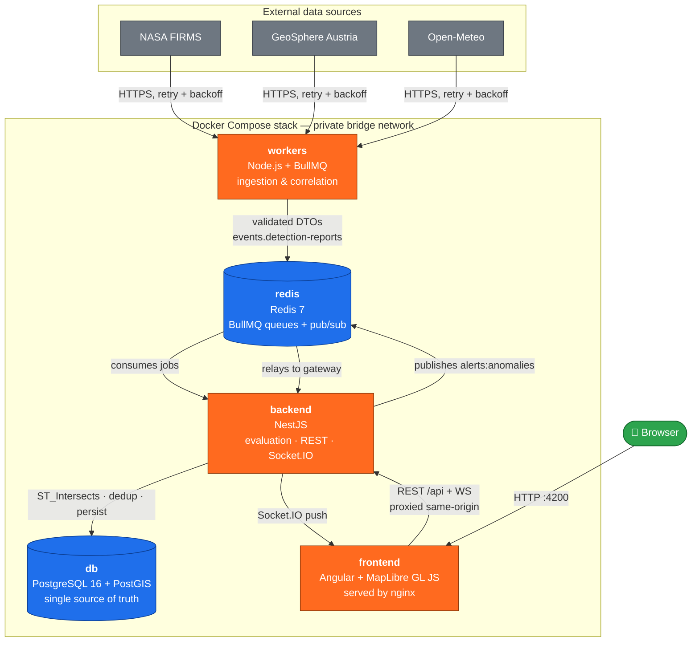
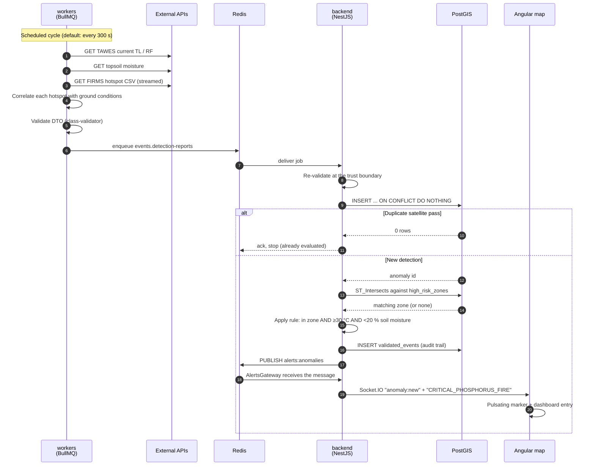
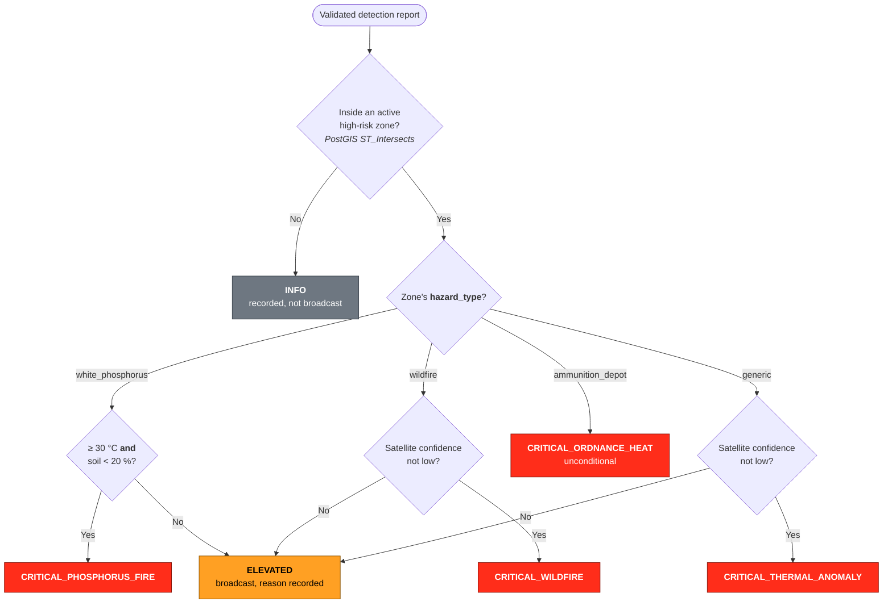
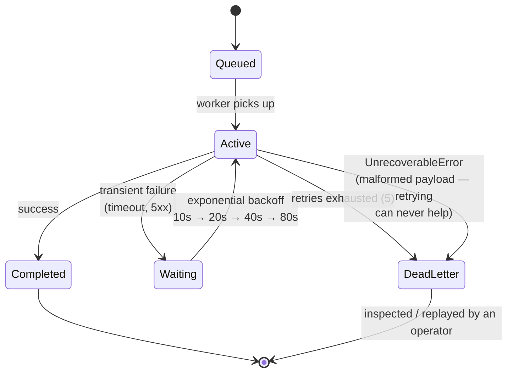
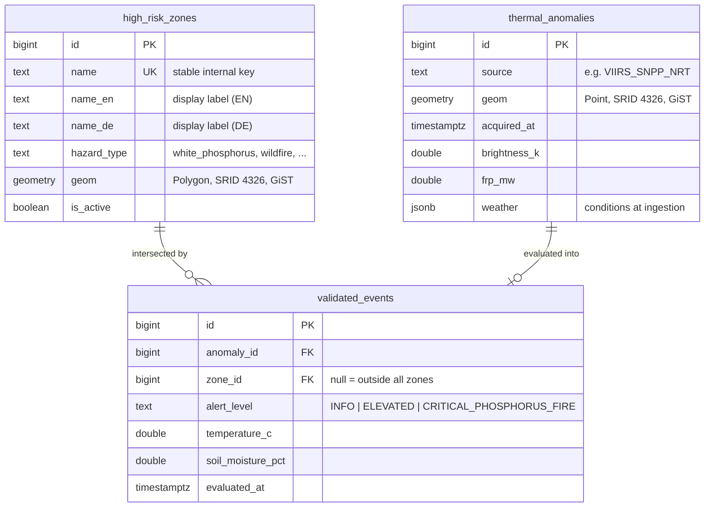

# OpenFireWatch — Architecture

This document describes how OpenFireWatch is built and, more importantly, **why**.
It follows the [C4 model](https://c4model.com/): each section zooms one level
further in, so you can stop reading as soon as you have the detail you need.

All diagrams are [Mermaid](https://mermaid.js.org/) source rather than exported
images — they render natively on GitHub, live next to the code they describe,
and show up as readable diffs when the architecture changes.

> **Quick overview?** The [README](../README.md#-architecture) has a one-screen
> summary. This document is the detailed reference.

---

## 1. System context

Who uses the system, and which external services it depends on.



**Why three data sources?** The phosphorus ignition rule needs two independent
physical conditions. FIRMS supplies the *heat signature*, TAWES the *ambient
temperature*, and Open-Meteo the *topsoil moisture* — TAWES publishes humidity
but not soil moisture, and air humidity is not a measure of how dry the ground is.

---

## 2. Containers

The five services started by a single `docker compose up`, and the two stateful
backing services they share.



| Container | Responsibility | Why it is separate |
| --------- | -------------- | ------------------ |
| `workers` | Poll external APIs, correlate hotspots with weather, validate, enqueue | A hung or rate-limited upstream API must never slow down or crash the API layer |
| `redis` | Durable job queues, dead letter queue, alert pub/sub | Decouples producers from consumers: either side can restart without data loss |
| `backend` | Evaluate the phosphorus rule, persist, serve REST/OpenAPI, relay WebSockets | Stateless — it holds no truth of its own, so it scales horizontally |
| `db` | Spatial filtering, deduplication, audit trail | Spatial logic belongs in PostGIS, not in application code |
| `frontend` | Situation map, alert dashboard | Static bundle; nginx also proxies `/api` so the browser sees one origin |

---

## 3. The critical path

What happens between a satellite pass and a red dot on a responder's screen.



### The escalation rule

The spatial test is the same for every zone; the **criteria that follow depend
on what the zone protects**.



| Hazard type | Critical level | Criteria | Rationale |
| ----------- | -------------- | -------- | --------- |
| `white_phosphorus` | `CRITICAL_PHOSPHORUS_FIRE` | ≥ 30 °C **and** topsoil < 20 % | The mechanism is weather-driven: P4 auto-ignites near 30 °C, but only once drought-cracked soil lets air reach it. Neither condition alone opens the danger window. |
| `wildfire` | `CRITICAL_WILDFIRE` | confidence not low | A satellite hotspot inside a forest already *is* a fire. Requiring warm, dry weather would suppress a real fire on a cool day or after rain. |
| `ammunition_depot` | `CRITICAL_ORDNANCE_HEAT` | none — always | Heat at an ordnance site is an emergency whatever the weather. A false alarm here is far cheaper than a missed one. |
| `generic` | `CRITICAL_THERMAL_ANOMALY` | confidence not low | Catch-all for a zone with no specific hazard model; also the fallback for an unknown `hazard_type`. |

### Smouldering nests ("Glutnester")

One rule sits **above** the hazard profiles, because it rests on evidence
rather than prediction.

| | |
| --- | --- |
| **Level** | `CRITICAL_SMOULDERING` |
| **Criteria** | ≥ 2 distinct satellite passes within 500 m, inside 72 h, all ≤ 5 MW — and the current detection itself ≤ 5 MW |
| **Precedence** | Outranks every hazard profile: those predict that ignition is *likely*, this observes that something is *already burning* |

**What this can and cannot do.** A true ember nest burning underground, in
root systems or under a closed canopy is **invisible** to VIIRS and MODIS: too
cool (~500–800 K against 1000 K+ for flame), far smaller than a 375 m pixel,
and screened by soil or foliage. No threshold changes that — confirming or
ruling one out needs a thermal camera on the ground or on a drone.

What *is* detectable is the **signature**: a flaming front travels, an ember
nest stays put and keeps radiating weakly. So the check looks at the history
already in PostGIS — repeated low-power detections at the same place across
separate passes — rather than at any single detection.

The alert carries its own evidence (`passes`, `windowHours`, `peakFrpMw`) into
the payload and onto the dashboard, so a responder sees *why* it was called,
not just the verdict. A steady industrial heat source inside a zone would look
identical; requiring the detection to fall inside an operator-drawn hazard zone
removes most such cases, and the rest is why a human makes the call.

A detection strong enough to be an active fire deliberately bypasses this rule
— otherwise a fresh blaze breaking out where embers had smouldered would
inherit the weak history and be understated.

**Why per-hazard criteria.** Every zone once shared the phosphorus thresholds,
which was wrong in both directions: a genuine forest fire on a cool, damp day
was downgraded to `ELEVATED`, and heat at an ammunition site was gated behind
soil moisture that has nothing to do with the risk. The profiles live in one
table (`HAZARD_PROFILES` in
[`alert-level.enum.ts`](../backend/src/evaluation/alert-level.enum.ts)) so an
operator can tune them — they are engineering defaults, not doctrine.

An in-zone detection that misses its criteria becomes `ELEVATED` and records
**why**, so the entry is actionable rather than merely puzzling.

## 4. Fault tolerance

Every external call sits behind the same bounded-retry ladder. This is why an
API outage degrades the system instead of breaking it.



| Failure | Behaviour |
| ------- | --------- |
| FIRMS or weather API down | Job retries with backoff; the schedule keeps ticking; nothing crashes |
| Database down | Jobs stay queued in Redis and are processed once it returns |
| Redis restarts | AOF persistence keeps queued jobs; clients reconnect with backoff |
| Backend redeploys | The browser's Socket.IO client reconnects automatically |
| FIRMS rate limit exceeded (5000 transactions / 10 min per key) | The response body explains itself and is copied verbatim into the dead-letter entry; at the default 300 s interval the system uses 2 of 5000 |
| FIRMS returns plain text instead of CSV (invalid key, quota) | The CSV header is validated, so the cycle fails loudly instead of reporting "zero hotspots" |
| Malformed payload | Fails fast to the dead letter queue with full context — never silently dropped |
| Same satellite pass ingested twice | Database unique constraint collapses it to one row |

---

## 5. Data model



**Notes**

- Everything is stored in **SRID 4326 (WGS84)** — the reference system used by
  GPS, GeoJSON and FIRMS alike — so detections intersect zones with no
  reprojection step.
- `UNIQUE (source, geom, acquired_at)` on `thermal_anomalies` makes ingestion
  idempotent at the database level.
- Zone labels are stored **per language**. One alert is published once and
  fanned out to many clients that may have different languages, so the server
  cannot localize ahead of time — the payload carries every language and the
  browser picks.
- `validated_events` keeps the verdict *and* its inputs, so any past alert can
  be audited after the fact.

### Where the schema lives

| Object | Created by | Reason |
| ------ | ---------- | ------ |
| `thermal_anomalies` | [`deploy/db/init.sql`](../deploy/db/init.sql) | Exists before the API starts |
| `high_risk_zones`, `validated_events` | [`RiskZoneService`](../backend/src/risk-zones/risk-zone.service.ts), [`AnomalyEvaluationService`](../backend/src/evaluation/anomaly-evaluation.service.ts) | `init.sql` runs only on a *fresh* volume; self-provisioning also reaches already-populated databases |

> A production deployment should replace both with versioned migrations. The
> current split keeps the scaffold turnkey — clone, `docker compose up`, done.

---

## 6. Key design decisions

| Decision | Rationale | Trade-off accepted |
| -------- | --------- | ------------------ |
| Spatial logic in PostGIS, not in code | `ST_Intersects` on a GiST index is exact and scales to thousands of polygons; hand-rolled bounding boxes are neither | SQL is harder to unit-test than pure functions |
| Raw SQL via `pg` instead of an ORM | The queries are spatial and set-based (CTE + `ON CONFLICT` + join in one round trip); ORMs obscure exactly the part that matters | No entity mapping or migrations out of the box |
| Evaluation inside the NestJS backend, not the workers | Keeps one consumer per queue and puts the domain rule next to the API that serves it | The "stateless" API owns one long-lived queue consumer |
| Redis pub/sub for alert fan-out | Any number of API replicas can relay to their own clients | Fire-and-forget; a missed live alert is recovered via REST |
| Configuration read and validated once at boot | Six numeric tunables were parsed at their point of use and only three checked the result, so `SENSOR_ALERT_TEMPERATURE_C=fifty` became a `NaN` threshold that no reading can ever exceed — a safety feature switched off in silence. A malformed value now stops the container with the variable's name | An environment change needs a restart, which is what a 12-factor deployment does anyway |
| One Redis connection factory, with the role named at the call site | Eight services had copied the same four lines and drifted: `maxRetriesPerRequest: null` (block through a broker restart, required by BullMQ) versus a finite value (fail the command so a hung broker cannot hang an HTTP response) is a real difference that had become accidental | Two named roles to choose between instead of a default that is right by luck |
| The alert rule as a pure function | It is the most consequential logic in the system and it lived inside a 190-line method that also validated a queue job, wrote two tables, logged and published — reachable only through PostGIS, Redis and BullMQ together. Now every threshold is checked at its boundary in milliseconds | The evaluation service composes two pieces rather than reading top to bottom |
| Rate limiting in the API, not only at the proxy | One GET on the report endpoint queries six subsystems and renders a PDF; nothing else in the stack bounded that. The limiter needs the client address, which is why nginx now forwards `X-Forwarded-For` | In-memory counters, so each replica counts its own callers — enough to stop one client hammering an expensive endpoint, not a fleet-wide quota |
| Replayed detections are marked, not separated | A second table for history would have meant a second copy of every query; one `backfilled` flag lets the live picture exclude them and the incident register include them, judged by acquisition time | Every live-picture query must remember the filter — the e2e suite checks the ones that matter |
| The FWI is computed, and says so | No public endpoint returns the figure for a point; EFFIS, GeoSphere and the national maps all publish the same published method. Running it on our weather is the method itself, pinned to the reference example by test — labelled "computed", never "official" | Inputs differ slightly from EFFIS's ECMWF run; a class boundary may fall a day apart |
| Frontend folders by feature, not by file type | A feature owns both its data access and its screen, so changing one thing means opening one folder; the alternative had an incident register whose API client and user interface lived in different trees | Cross-feature imports need path aliases to stay readable |
| One HTTP client with an interceptor, instead of `fetch` per service | The operator credential is attached in exactly one place and dropped in exactly one place; five hand-written copies had already drifted | A promise wrapper over an RxJS API — one small layer that exists to keep call sites in `async/await` |
| Runtime i18n instead of Angular's build-time i18n | One bundle can follow the browser language and switch live | Translations ship in the bundle rather than being tree-shaken per locale |
| Bounded retries + dead letter queue everywhere | Failures become visible and replayable instead of silent | Operators must actually watch the DLQ |
| Public reads, API-key-guarded writes, failing closed | A situation map is meant to be watched, but zones decide whether an alert fires at all and the drill endpoint can fabricate one; an unset key locks writes rather than leaving them open | Single shared key — a multi-user deployment needs real accounts and a per-user audit trail |
| Hand-rolled polygon drawing instead of a draw library | "Click a few corners and close the ring" is ~100 lines against MapLibre's own GeoJSON sources | No vertex dragging or snapping; redrawing replaces an outline |
| Derive the polled bounding box from the hazard zones | The box and the zones were two hand-maintained settings whose mismatch disabled alerting *silently*; deriving one from the other makes that state unrepresentable and reduces zone management to a single SQL statement | The workers need a read-only database connection; `FIRMS_AREA` remains as an explicit override |
| One weather reading per ingestion cycle, not per hotspot | A single API call covers a compact monitoring area and keeps the cycle fast | Only valid while `FIRMS_AREA` stays small — see the note in `.env.example` |
| Validate the FIRMS CSV header before parsing | FIRMS reports some errors as plain text with HTTP 200; trusting it would yield "zero hotspots" — indistinguishable from "no fires" | One extra guard on every ingestion cycle |

---

## 7. Related documentation

- [README](../README.md) — overview, quick start, contributing
- [Frontend architecture](frontend-architecture.md) — how the Angular
  application is organised: feature folders, the single HTTP door, and where
  signals end and event streams begin
- [Satellite archive backfill](satellite-backfill.md) — replaying FIRMS
  history through the live rule, and what the `backfilled` mark changes
- [Fire danger (FWI)](fire-danger.md) — the Canadian index on the panel and
  why it is computed rather than fetched
- [Monitoring areas & risk zones](monitoring-areas.md) — operator guide for
  changing `FIRMS_AREA` and maintaining `high_risk_zones`
- [Deployment](deployment.md) — running it publicly with TLS, backups and
  update procedure
- [`docker-compose.yml`](../docker-compose.yml) — the full local stack
- [`backend/test/app.e2e-spec.ts`](../backend/test/app.e2e-spec.ts) — the
  architecture verified end to end against real PostGIS and Redis
- Swagger UI at `/api/docs` when the stack is running — including
  `GET /api/risk-zones`, the GeoJSON feed the map draws its overlay from

### Operator commands

```bash
# Remaining NASA FIRMS quota for the configured key (5000 / 10 minutes)
curl "https://firms.modaps.eosdis.nasa.gov/mapserver/mapkey_status/?MAP_KEY=$(grep '^FIRMS_MAP_KEY=' .env | cut -d= -f2-)"
```

```bash
# Jobs that exhausted their retries and need a human
docker compose exec redis redis-cli ZRANGE bull:dlq.ingestion:completed 0 -1
```
