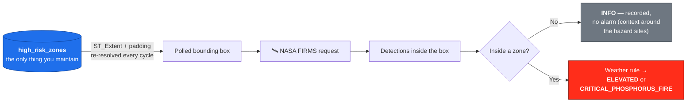

# Monitoring areas & risk zones

How to enlarge the observed area, move it somewhere else, or add further
hazard zones — and how to verify that the change actually works.

> Every SQL snippet in this guide is copy-paste runnable against the running
> stack (`docker compose up -d`).

---

## 1. The mental model: zones are the only thing you configure

A hotspot must satisfy **two** conditions to raise an alert: it must lie inside
the **polled bounding box** (what we ask NASA about) and inside a **hazard
zone** (what escalates). Those used to be two hand-maintained settings — and a
box that failed to cover its zones disabled them *silently*.

They are now **one**: the box is derived from the zones on every cycle.



**Consequence: adding a zone is the entire procedure.** The polled area grows
to cover it on the next cycle — no configuration change, no restart, no
rebuild. Retiring a zone shrinks the area again.

> The invariant "the box must cover the zones" is no longer something you can
> get wrong. It used to be: writing an earlier draft of this guide uncovered
> exactly that defect in the project's own defaults — the seeded Föhrenwald
> polygon lay outside the configured box, so real satellite data could never
> have triggered it, while `simulate-fire` (which bypasses NASA) kept reporting
> success. Deriving the box makes that state unrepresentable.

---

## 2. Changing the observed area

### 2.1 The normal case: do nothing

Add or retire zones (section 3). The area follows automatically. Verify with:

```bash
docker compose logs workers | grep '\[ingest\] area' | tail -2
```

```
[ingest] area [16.195,47.705,16.36,47.845] (zones) — resolved for this cycle
```

`(zones)` confirms the box was derived. The padding around the zone extent is
`FIRMS_AREA_PADDING_DEG` (default `0.05`° ≈ 5.5 km), which keeps detections
just outside a boundary visible as context.

### 2.2 The exception: watching a wider area deliberately

Set `FIRMS_AREA` to take manual control — for example to collect context
detections well beyond the hazard sites:

```bash
# .env — west,south,east,north (WGS84). Longitude first, like GeoJSON.
FIRMS_AREA=15.95,47.68,16.38,47.92
```

```bash
docker compose up -d --force-recreate workers
```

`--force-recreate` matters: editing `.env` does not change a running container.
The log then reads `(override)` instead of `(zones)`, and **you** become
responsible for the box covering every zone — use Check 2 in section 4.

Clear the value (`FIRMS_AREA=`) to return to automatic derivation.

### 2.3 What a larger area costs

| Concern | Reality |
| ------- | ------- |
| NASA rate limit | A bigger box is still **one** request per cycle — 2 of 5000 per 10 min at the default interval |
| Database size | Only real detections are stored; deduplication prevents repeats |
| Alert noise | Detections outside your zones are `INFO` — recorded, never broadcast |
| **Weather accuracy** | ⚠️ **Degrades.** See below. |

**The one real cost.** One TAWES station reading (`GEOSPHERE_STATION_ID`) plus
one soil-moisture sample at the box centroid is applied to *every* hotspot in
the box. That is accurate for a compact area like the Föhrenwald (~15 km
across). Across a whole country it is meaningless: the ignition rule would
judge a distant fire by the weather at your station, which can both **miss real
danger** and **raise false alarms**.

Keep the zones — and therefore the derived box — within roughly the area a
single weather station represents. To monitor scattered or large regions
properly, fetch weather per detection coordinate: see `fetchStationWeather()`
and `fetchTopsoilMoisturePct()` in
[`workers/src/clients/`](../workers/src/clients/), and replace the single
per-cycle lookup in
[`ingest.task.ts`](../workers/src/ingestion/ingest.task.ts) with a per-hotspot
one (cache by rounded coordinate to stay polite to the upstream API).

---

## 3. Adding a risk zone

### 3.1 In the UI (recommended)

The map has a **HAZARD ZONES** panel in the top-left corner:

1. **Unlock** — paste the operator key (`OPERATOR_API_KEY` from `.env`). It is
   held in `sessionStorage`, so it is gone when the tab closes and never
   persists on a shared workstation.
2. **+ New zone** — click on the map to place corners. The outline previews
   live; `↶ Undo point` removes the last one, `Backspace`/`Enter`/`Escape`
   work as expected, and a double-click closes the ring.
3. **Name it in both languages** and pick a hazard type.
4. **Save.** The zone is stored, appears on the map immediately, and the
   polled satellite area widens to cover it on the next cycle.

Retiring works the same way: `Retire` asks for confirmation inline, then
deactivates the zone — the map and the polled area update, the alert history
stays.

> Writes require `OPERATOR_API_KEY` to be set. If it is missing, the API
> refuses every write with `503` rather than running unprotected.

### 3.2 By SQL or API (scripting, migrations, bulk import)

The table is `high_risk_zones`. Adding rows directly is equivalent — the API
and the UI write the same columns.

| Column | Required | Notes |
| ------ | -------- | ----- |
| `name` | ✅ | **Stable internal key**, never shown to users. The API derives a slug from the English name; by hand, use one like `foehrenwald-demo`. Unique. |
| `name_en`, `name_de` | ✅ | Display labels. Both travel to every browser, which picks by language. |
| `hazard_type` | – | `white_phosphorus` (default), `wildfire`, `ammunition_depot`, `generic`. **This choice decides the escalation criteria and the alert label** — see [Architecture § escalation rule](architecture.md#the-escalation-rule). An unknown value falls back to `generic`. |
| `geom` | ✅ | `GEOMETRY(Polygon, 4326)`. A **single, closed** polygon per row. |
| `is_active` | – | Defaults to `TRUE`. `FALSE` retires the zone without deleting its history. |

Via the API — validation errors name the exact problem:

```bash
curl -X POST http://localhost:8000/api/risk-zones \
  -H "X-API-Key: $(grep '^OPERATOR_API_KEY=' .env | cut -d= -f2-)" \
  -H 'Content-Type: application/json' \
  -d '{
    "nameEn": "Wiener Neustadt — former depot",
    "nameDe": "Wiener Neustadt — ehemaliges Depot",
    "hazardType": "ammunition_depot",
    "geometry": {
      "type": "Polygon",
      "coordinates": [[[16.20,47.83],[16.26,47.83],[16.26,47.79],[16.20,47.79],[16.20,47.83]]]
    }
  }'
```

Directly in SQL — `ON CONFLICT … DO UPDATE` keeps the statement replayable:

```bash
docker compose exec db psql -U openfirewatch -d openfirewatch <<'SQL'
INSERT INTO high_risk_zones (name, name_en, name_de, hazard_type, geom)
VALUES (
  'wiener-neustadt-depot',
  'Wiener Neustadt — former depot',
  'Wiener Neustadt — ehemaliges Depot',
  'ammunition_depot',
  -- GeoJSON coordinates are [longitude, latitude] and the ring must close
  -- (first pair == last pair). ST_SetSRID stamps WGS84 explicitly.
  ST_SetSRID(ST_GeomFromGeoJSON('{
    "type": "Polygon",
    "coordinates": [[
      [16.20, 47.83],
      [16.26, 47.83],
      [16.26, 47.79],
      [16.20, 47.79],
      [16.20, 47.83]
    ]]
  }'), 4326)
)
ON CONFLICT (name) DO UPDATE
  SET name_en = EXCLUDED.name_en,
      name_de = EXCLUDED.name_de,
      geom    = EXCLUDED.geom;
SQL
```

### 3.3 Keeping zones in version control

Zones created in the UI live only in the database volume. For zones that must
survive a volume rebuild — and be reviewable in a pull request — keep them as
re-runnable SQL under [`deploy/zones/`](../deploy/zones/):

```bash
docker compose -f docker-compose.yml exec -T db \
  psql -U openfirewatch -d openfirewatch < deploy/zones/st-egyden-foehrenwald.sql
```

[`st-egyden-foehrenwald.sql`](../deploy/zones/st-egyden-foehrenwald.sql) is a
worked example: the pine forest around St. Egyden am Steinfeld, derived from
OpenStreetMap land cover, simplified with PostGIS, and written with
`ON CONFLICT … DO UPDATE` so applying it repeatedly is a no-op.

### 3.4 Importing an existing polygon file

For a real hazard boundary you will usually receive a Shapefile or GeoJSON.
Extract the geometry and feed it to the statement above:

```bash
# A GeoJSON Feature file -> just the geometry object
python3 -c "import json,sys; print(json.dumps(json.load(open('zone.geojson'))['features'][0]['geometry']))"
```

If the source uses a different projection (Austrian data is often EPSG:31287),
reproject on insert — never store the raw coordinates:

```sql
-- ST_Transform converts to 4326; everything in this system is WGS84.
ST_Transform(ST_SetSRID(ST_GeomFromGeoJSON('…'), 31287), 4326)
```

If the source is a MultiPolygon (disjoint areas), insert **one row per part** —
the column type is `Polygon`:

```sql
-- ST_Dump splits a MultiPolygon into its individual polygons.
SELECT (ST_Dump(ST_GeomFromGeoJSON('…'))).geom;
```

---

## 4. Verifying a new zone

Run these three checks in order. They take seconds and catch every common
mistake.

### Check 1 — is the geometry valid and in the right place?

```bash
docker compose exec db psql -U openfirewatch -d openfirewatch -c \
"SELECT name, name_de, hazard_type, is_active,
        ST_IsValid(geom) AS valid,
        ST_SRID(geom)    AS srid,
        ROUND((ST_Area(geom::geography) / 1e6)::numeric, 2) AS km2,
        ROUND(ST_Y(ST_Centroid(geom))::numeric, 4) AS center_lat,
        ROUND(ST_X(ST_Centroid(geom))::numeric, 4) AS center_lon
   FROM high_risk_zones ORDER BY id;"
```

Expect `valid = t`, `srid = 4326`, and a plausible area and centre. An
implausible `km2` (or a centre in the Gulf of Guinea, i.e. `0,0`) means the
coordinates were swapped — latitude and longitude the wrong way round.

### Check 2 — only if you set `FIRMS_AREA` manually

With the derived default this check is unnecessary: the box is built *from* the
zones, so it always covers them. It matters only when you override the box.

```bash
docker compose exec db psql -U openfirewatch -d openfirewatch -c \
"SELECT z.name,
        ST_Within(z.geom, ST_MakeEnvelope(15.95, 47.68, 16.38, 47.92, 4326)) AS fully_inside
   FROM high_risk_zones z WHERE z.is_active;"
```

Substitute your own `FIRMS_AREA` numbers (same `west, south, east, north`
order). Anything other than `fully_inside = t` means detections in the
uncovered part are never ingested, so that part of the zone cannot alert.

### Check 3 — does a point in the zone actually match?

Simulates the exact query the evaluation service runs:

```bash
docker compose exec db psql -U openfirewatch -d openfirewatch -c \
"SELECT z.name_en
   FROM high_risk_zones z
  WHERE z.is_active
    AND ST_Intersects(z.geom, ST_SetSRID(ST_MakePoint(16.2300, 47.8100), 4326));"
```

Replace the coordinates with your zone's centre from Check 1 — note
`ST_MakePoint(longitude, latitude)`, **x first**. One row back means the zone
will escalate detections. No rows means it never will.

---

## 5. Showing the zone on the map

Nothing to do — it is automatic.

The map fetches its overlay from `GET /api/risk-zones`, which serves every
active zone as GeoJSON built directly by PostGIS. A zone inserted with the SQL
above appears on the next page load, with **no rebuild and no redeploy** of any
service. Zone geometry lives in exactly one place: the database.

```bash
# What the map will draw
curl -s http://localhost:8000/api/risk-zones | python3 -m json.tool
```

Each feature carries `id`, `hazardType` and a per-language `name` object
(`{ "en": …, "de": … }`), so the same response serves browsers in either
language.

## 6. Retiring a zone

Never `DELETE` a zone that has already produced alerts — `validated_events`
references it, and deleting destroys the audit trail. Deactivate instead:

```bash
docker compose exec db psql -U openfirewatch -d openfirewatch -c \
"UPDATE high_risk_zones SET is_active = FALSE WHERE name = 'wiener-neustadt-depot';"
```

`findZonesContaining()` filters on `is_active`, so the zone stops escalating
immediately — no restart required — while its history stays intact. The
`Retire` button in the UI does exactly this.

---

## 7. Adding a satellite source

`FIRMS_SOURCE` selects the product: `VIIRS_SNPP_NRT` (default, 375 m),
`VIIRS_NOAA20_NRT` (a second overpass per day), or `MODIS_NRT` (1 km, longer
history). A finer resolution and more overpasses mean earlier detection.

The ingestion cycle currently fetches **one** source. Supporting several means
looping in [`ingest.task.ts`](../workers/src/ingestion/ingest.task.ts) — each
source costs one extra NASA transaction per cycle (the budget is 5000 per 10
minutes, so this is not a practical constraint). Detections from different
sources deduplicate independently, because `source` is part of the unique key.

---

## 8. Pitfall summary

| Symptom | Cause | Fix |
| ------- | ----- | --- |
| New zone never alerts | Only possible with a manual `FIRMS_AREA` override | Clear `FIRMS_AREA`, or see section 4, Check 2 |
| Zone appears in the Gulf of Guinea / wrong continent | Latitude and longitude swapped | GeoJSON is `[lon, lat]`; `ST_MakePoint(lon, lat)` |
| `Geometry type (MultiPolygon) does not match column type (Polygon)` | Source file has disjoint parts | Split with `ST_Dump`, one row per part |
| Weather values look wrong for distant detections | One station applied to a large box | Section 2.5 |
| `.env` edited but nothing changed | Running container keeps its old environment | `docker compose up -d --force-recreate workers` |
| `No active high-risk zones — nothing to monitor` | Every zone is inactive or deleted | Add or re-activate a zone, or set `FIRMS_AREA` |
| `duplicate key value violates unique constraint` | `name` already used | Use `ON CONFLICT (name) DO UPDATE` |

---

## 9. Running the stack in production mode

```bash
# Development (default): db and redis are published on localhost so that
# psql, redis-cli and `npm run test:e2e` can reach them.
docker compose up -d
```

```bash
# Production: base file only. Postgres and Redis stay on the private network;
# the only ports on the host are the API and the web UI.
docker compose -f docker-compose.yml up -d
```

Before a production start, make sure `.env` contains real secrets rather than
the documented defaults:

```bash
# Both must be strong and unique — the .env.example values are public.
openssl rand -hex 24   # POSTGRES_PASSWORD
openssl rand -hex 24   # OPERATOR_API_KEY
```

The E2E suite connects to the database directly, so it needs the development
override running plus the credentials from `.env`:

```bash
docker compose up -d && cd backend && set -a && . ../.env && set +a && npm run test:e2e
```

---

## Related documentation

- [Architecture](architecture.md) — how the pieces fit together and why
- [`.env.example`](../.env.example) — every setting, with inline commentary
- [README](../README.md) — quick start
